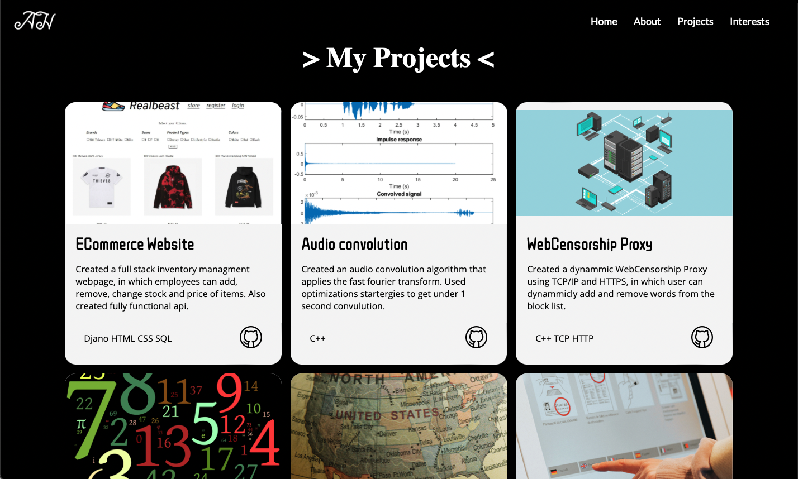

# My Personal Portfolio 
This is my first ever personal portfolio created entirely using HTML and CSS. During this project I learned how to use HTML and it's different elements. Moreover I also learned how to use CSS to properly style a page and use things including flexboxs and grids to make dynamically scalable web pages.
